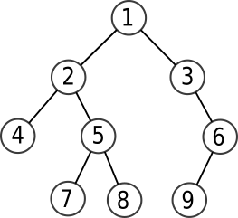
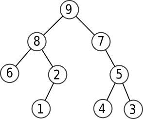

# TD

{{ initexo(0) }}

!!! example "{{ exercice() }}"
    === "énoncé"
        Dessiner tous les arbres binaires ayant respectivement 3 et 4 nœuds.

!!! example "{{ exercice() }}"
    === "énoncé"
        Ci dessous un arbre binaire :

        

        Donner le rendu de chaque parcours :

        1. Parcours en largeur
        2. Parcours préfixe
        3. Parcours infixe
        4. Parcours postfixe

!!! example "{{ exercice() }}"
    === "énoncé"
        Ci-dessous un arbre binaire :

        

        Donner le rendu de chaque parcours :

        1. Parcours en largeur
        2. Parcours préfixe
        3. Parcours infixe
        4. Parcours postfixe
