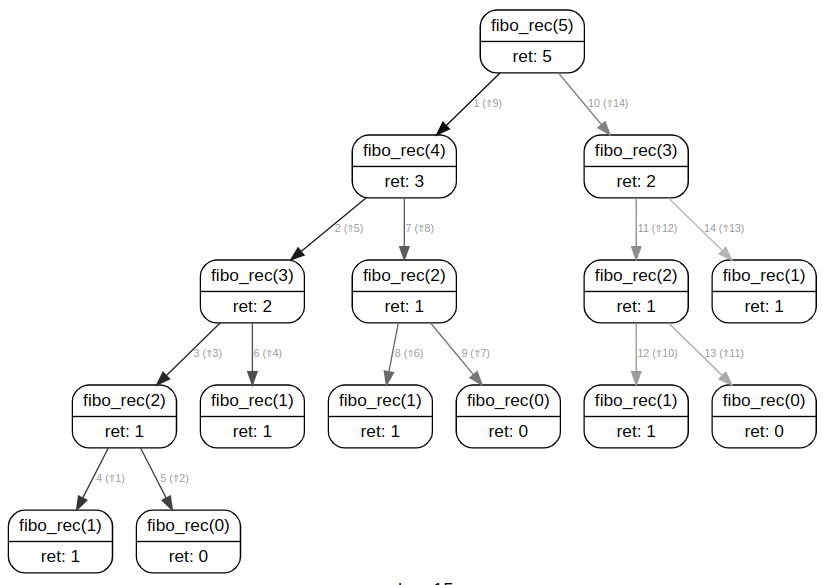

# TD

{{ initexo(0) }}


!!! example "{{ exercice() }} : BD"
    === "énoncé"
        Coder la fonction `prix(etage)` de la BD présentée dans le cours.
    === "correction"
        {{ correction(True,
        """
        ```python
        def prix(etage):
            if etage == 0:
                return 3
            else:
                return 2 * prix(etage - 1)
        ```
        """
        )}}

!!! example "{{ exercice() }} : Factorielle"
    === "énoncé"
        On considère la fonction factorielle(n) (notée $n!$ en mathématiques), qui calcule le produit d'un entier  par les entiers positifs qui lui sont inférieurs:

        $$n! = n \times (n-1) \times (n-2) \times \ldots \times 3 \times 2 \times 1$$

        Exemple : $5! = 5 \times 4 \times 3 \times 2 \times 1 = 120$

        Par convention, $0! = 1$

        1. Programmer de manière itérative (manière classique) la fonction factorielle. On l'appelera `fact_it()`.
        2. Programmer de façon récursive la fonction factorielle. On l'appelera `fact_rec()`.

        Quelle paradigme de programmation vous a semblé le plus naturel ?
    === "correction"
        {{ correction(True,
        """
        ```python
        # 1. Itératif
        def fact_it(nb):
            res = 1
            for i in range(1, nb + 1):
                res *= i
            return res
        
        # 2. récursif
        def fact_rec(nb):
            if nb == 0:
                return 1
            else:
                return nb * fact_rec(nb - 1)
        ```
        """
        )}}

!!! example "{{ exercice() }} : Minimum liste"
    === "énoncé"
        Supposons que nous ayons une fonction `min(a, b)` qui renvoie le plus petit des entiers `a` et `b` et une liste d'entiers dont il faut déterminer le minimum.

        1. Programmmer une fonction itérative `mini_it(lst)` permettant de déterminer le minimum de la liste `lst`.
        2. Programmmer une fonction récursive `mini_rec(lst)` permettant de déterminer le minimum de la liste `lst`.
        3. Ecrire l'arbre d'appels récursifs de cette dernière fonction pour l'appel de `mini_rec([4, 7, -1, 8])`
        4. Ecrire une fonction récursive `mini_rec2(lst, i = 0)` déterminant le minimum de la liste `lst` sans détruire la liste. *`i = 0` est un paramètre optionnel à 0 par défaut permettant de gérer l'indice à partir duquel on cherche le minimum.*
    === "correction"
        {{ correction(True,
        """
        ```python
        # 1. Itératif
        def mini_it(lst):
            mini = lst[0]
            for elem in lst:
                mini = min(mini, elem)
            return mini
        
        # 2. récursif
        def mini_rec(lst):
            if len(lst) == 1:
                return lst[0]
            else:
                dernier_element = lst.pop()
                return min(dernier_element, mini_rec(lst))
        
        # 3. mini_rec([4, 7, -1, 8]) --> mini_rec([4, 7, -1]) --> mini_rec([4, 7]) --> mini_rec([4])
        # 4. 
        def mini_rec2(lst, i = 0):
            if i == len(lst) - 1:
                return lst[-1]
            else:
                return min(lst[i], mini_rec2(lst, i + 1))
        ```
        """
        )}}

!!! example "{{ exercice() }} : Occurences liste"
    === "énoncé"
        Programmer une fonction récursive `count_rec(lst, elem, i = 0)` comptant le nombre d'occurence de l'élément `elem` dans la liste `lst`.
    === "correction"
        {{ correction(True,
        """
        ```python
        def count_rec(lst, elem, i = 0):
            if i == len(lst):
                return 0
            else:
                if lst[i] == elem:
                    return 1 + count_rec(lst, i + 1)
                else:
                    return count_rec(lst, i + 1)
        ```
        """
        )}}

!!! example "{{ exercice() }} : Doublons liste"
    === "énoncé"
        Programmer une fonction récursive `contient_doublons(lst, i = 0)` renvoyant `True` si la liste non vide `lst` contient des doublons, et `False` sinon.
    === "correction"
        {{ correction(True,
        """
        ```python
        def contient_doublons(lst, i = 0):
            if i == len(lst) - 1:
                return False
            else:
                for j in range(i + 1, len(lst)):
                    if lst[i] == lst[j]:
                        return True
                return contient_doublons(lst, i + 1)
        ```
        """
        )}}

!!! example "{{ exercice() }} : Palindrome"
    === "énoncé"
        Pour rappel, un palindrome est un mot qui se lit indifféremment de gauche à droite ou de droite à gauche (par exemple: “kayak”, “elle” ou “radar”). Écrivez la fonction récursive `est_palindrome(chaine)` renvoyant :
        
        - `True` si la chaîne passée en paramètre est un palindrome, et 
        - `False` sinon (on suppose que tous les caractères sont des minuscules non accentuées).
    === "correction"
        {{ correction(True,
        """
        ```python
        def est_palindrome(chaine, i = 0):
            if i == len(chaine) // 2:
                return True
            else:
                if chaine[i] == chaine[- i - 1]:
                    return est_palindrome(chaine, i + 1)
                else:
                    return False
            # OU en plus simple mais plus tricky:
            #   return chaine[i] == chaine[- i - 1] and est_palindrome(chaine, i + 1)
        ```
        """
        )}}

!!! example "{{ exercice() }} : Fibonacci"
    === "énoncé"
        Considérons la suite numérique ainsi définie:

        - $F_0 = 0$
        - $F_1 = 1$
        - $\forall n \in \mathbb{N}, F_{n+2} = F_{n+1}+F_n$

        On a donc $F_2=0+1=1, F_3=F_2+F_1=1+1=2, F_4=F_3+F_2=2+1=3, F_5=F_4+F_3=3+2=5$ ...

        1. Programmer une fonction itérative `fibo_it(n)` retournant $F_n$. Exemple:
        ```python
        >>> fibo_it(6)
        8
        >>> fibo_it(7)
        13
        ```
        2. Programmer un fonction récursive `fibo_rec(n)` retournont $F_n$. *Conseil: se rapprocher de la définition*
        3. Dessiner l'arbre d'appel de `fibo_rec(5)`.

    === "correction"
        {{ correction(True,
        """
        ```python
        # 1. itératif
        def fibo_it(nb):
            if nb == 0:
                return 0
            elif nb == 1:
                return 1
            else:
                f0, f1 = 0, 1
                for i in range(2, nb + 1):
                    f2 = f1 + f0
                    f0 = f1
                    f1 = f2
                return f2

        # 2. récursif
        def fibo_rec(nb):
            if nb == 0:
                return 0
            elif nb == 1:
                return 1
            else:
                return fibo_rec(nb - 1) + fibo_rec(nb - 2)

        #3. 
        ```
        <figure markdown>
        
        </figure>
        """
        )}}

!!! example "{{ exercice() }}"
    === "Énoncé"
        La conjecture de Syracuse (ou de Collatz) postule ceci :  

        *Prenons un nombre $n$ : si $n$ est pair, on le divise par 2, sinon on le multiplie par 3 puis on ajoute 1. On recommence cette opération tant que possible. Au bout d'un certain temps, on finira toujours par tomber sur le nombre 1.*

        1. Proposer un programme récursif ```syracuse(n)``` écrivant tous les termes de la suite de Syracuse, s'arrêtant (on l'espère) à la valeur 1.
        2. On appelle «temps de vol» le nombre d'étapes nécessaires avant de retomber sur 1. Modifier la fonction précédente afin qu'elle affiche le temps de vol pour tout nombre ```n```.

    === "Correction"
        {{ correction(True,
        "
        1.
        ```python linenums='1'
        def syracuse(n):
            print(n)
            if n == 1:
                return None
            if n % 2 == 0:
                syracuse(n // 2)
            else:
                syracuse(3 * n + 1)
        ```
        2.
        ```python linenums='1'
        def syracuse(n):
            print(n)
            if n == 1:
                return 1
            if n % 2 == 0:
                return 1 + syracuse(n // 2)
            else:
                return 1 + syracuse(3 * n + 1)
        ``` 
        "
        ) }}        

!!! example "{{ exercice() }}"
    === "Énoncé"
        On considère le jeu des **Tours de Hanoï**.
        Le but est de faire passer toutes les assiettes de A vers C, sachant qu'une assiette ne peut être déposée que sur une assiette de diamètre inférieur.
        {: .center width=60%}

        Une version jouable en ligne peut être trouvée [ici](https://www.mathsisfun.com/games/towerofhanoi.html).

        1. S'entraîner et essayer d'établir une stratégie de victoire.
        2. Observer les images ci-dessous :
        {: .center width=60%}
        {: .center width=60%}
        {: .center width=60%}
        {: .center width=60%}


        Écrire une fonction récursive ```hanoi(n, A, B, C)``` qui donnera la suite d'instructions (sous la forme " A vers C") pour faire passer une pile de taille n de A vers C en prenant B comme intermédiaire.

    === "Correction"
        {{ correction(True,
        """
        ```python linenums='1'
        def hanoi(n, depart, inter, arrivee):
            ''' n : nombre d'assiettes dans la pile
            # depart : la pile de départ('A', 'B' ou 'C')
            # inter : la pile intermédaire('A', 'B' ou 'C')
            # arrivee : la pile d'arrivée ('A', 'B' ou 'C') '''

            if n == 1 :
                print(depart + ' vers ' + arrivee)
            else :
                hanoi(n-1, depart, arrivee, inter) 
                hanoi(1, depart, inter, arrivee)
                hanoi(n-1, inter, depart, arrivee)

        hanoi(5, 'A', 'B', 'C')
        ```
        """)}}


