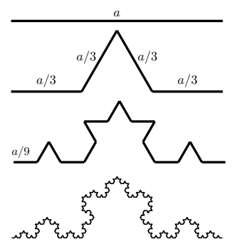
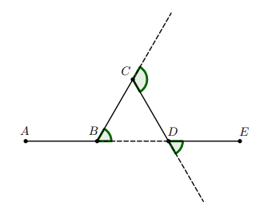
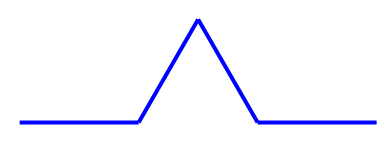
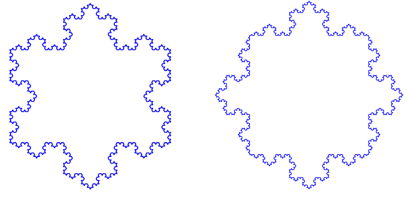

# TP

## 1. Flocon

### 1.1 Le flocon de Von-Koch

Helge Von-Koch (1870-1924) est un mathématicien
suédois qui a donné son nom en 1904 à l’une des premières
fractales, le flocon de Von-Koch. Il a décrit ce flocon dans
un article intitulé " _Sur une courbe continue sans tangente,
obtenue par une construction géométrique élémentaire_ ".

### 1.2 Méthode de construction :

- On commence par un segment de longueur $a$ ;
- On coupe ce segment en 3 parties égales : le segment central est remplacé par un triangle équilatéral de coté $\dfrac{a}{3}$ ;
- Chaque segment de longueur $\dfrac{a}{3}$ est lui même découpé en trois parties égales (donc de longueur $\dfrac{a}{9}$ ) : on remplace la partie centrale par un triangle équilatéral de côté $\dfrac{a}{9}$ ;
- etc...

On décide à l’avance quand on doit s’arrêter




### 1.3 Les angles

{{ initexo(0) }}

!!! example "{{ exercice(nom = "Q") }}"
    Compléter la figure ci-dessous en indiquant les mesures des angles en degré :

    <figure markdown>
    
    </figure>


### 1.4 Le module turtle

En Python le module turtle permet de réaliser des figures.
Voici l’instruction d’import du module turtle, et notre tortue se nommera t:
`import turtle as t`

!!! example "{{ exercice(nom = "Q") }}"
    Observer le code ci-dessous. Avant de le coder sur une machine, dessiner la figure qui doit être affichée.

    ```python
    import turtle as t

    # déplace la tortue aux coordonnées
    t.penup()
    t.goto(-200, 200)
    t.pendown()

    # orientation intiale de la tête :
    # vers la droite de l’écran
    t.setheading(0)
    # on cache la tortue
    t.hideturtle()
    # on accélère la tortue
    t.speed(0)
    # définition des caractéristiques du tracé
    t.color('blue')
    t.pensize(1)

    # on trace la figure
    t.forward(100)
    t.left(90)
    t.forward(100)
    t.right(90)
    t.forward(100)
    t.right(90)
    t.forward(100)
    t.left(90)
    t.forward(100)
    ```

!!! example "{{ exercice(nom = "Q") }}"
    Modifier le code ci-contre afin d’obtenir la figure ci-dessous :

    <figure markdown>
    
    </figure>

!!! example "{{ exercice(nom = "Q") }}"
    Recopier et compléter l’algorithme récursif suivant afin de réaliser une des figure décrite dans la partie "méthode de construction" :

    ```
    Variables:
    n : entier indiquant le nombre d’étape à réaliser
    taille : la longueur du segment initial

    Définition flocon(n,taille) :
        Si n = 0 alors
            Tracer le segment de longueur cote
        Sinon
            Appeler la fonction flocon avec les paramètres ...
            Tourner la tortue ....
            ...
        FinSi
    FinDéfinition
    ```
!!! example "{{ exercice(nom = "Q") }}"
    === "énoncé"
        Implémenter en Python la fonction `flocon`.
    === "corrigé"
        {{ correction(False, """
        ```python
        import turtle as t
        def flocon(n, taille):
            if n == 0:
                t.forward(taille)
            else:
                flocon(taille / 3)
                t.left(60)
                flocon(taille / 3)
                t.right(120)
                flocon(taille / 3)
                t.left(60)
                flocon(taille / 3)
        ```
        """)}}

!!! example "{{ exercice(nom = "Q") }}"
    Écrire un programme Python utilisant la fonction `flocon` afin de construire les figures ci-dessous :

    <figure markdown>
    
    </figure>


## 2. Coloration de zones

L'objectif est de changer la couleur des pixels d'une zone d'une image


Nous partons du code ci-dessous:

```python
import matplotlib.pyplot as plt

class Pile:
    def __init__(self):
        self.contenu = []

    def empiler(self, elem):
        self.contenu.append(elem)

    def depiler(self):
        return self.contenu.pop()

    def est_vide(self):
        return len(self.contenu) == 0


class Image:
    lst_voisins = ((-1, 0), (1, 0), (0, -1), (0, 1))

    def __init__(self):
        self.image = [[2] * (5-i) + [0] * (2*i+1) + [2] * (5-i) for i in range(5)]
        self.hauteur = len(self.image)
        self.largeur = len(self.image[0])

    def get_pixel(self, i, j):
        return ...
    
    def set_pixel(self, i, j, c):
        ...

    def est_dedans(self, i, j):
        ...

    def voisins(self, i, j):
        p =  Pile()
        for x, y in Image.lst_voisins:
            ...
        return p

    def colorer_zone(self, i, j, couleur):
        ...

    def affiche(self):
        plt.imshow(self.image, vmin = 0, vmax = 2)
        plt.show()

i = Image()
i.affiche()
```

Il existe donc une classe `Image` ayant pour attributs:

- `image` une liste de listes d'entiers de 0 à 2 représentants des couleurs.
- `hauteur` la hauteur de l'image: le nombe de pixel par colonne.
- `largeur` la largeur de l'image: le nombe de pixel par ligne.


!!! example "{{ exercice(nom = "Q") }}"
    Compléter les méthodes `get_pixel` et `set_pixel`. `get_pixel` récupère l'entier correspondant à la couleur à l'emplacement `(i, j)` et `set_pixel` modifie l'entier correspondant à la couleur à l'emplacement `(i, j)`.

!!! example "{{ exercice(nom = "Q") }}"
    Compléter la méthode `est_dedans` de paramètres `i` et `j` qui retourne:

    - `True` si le pixel de coordonnées `(i, j)` existe bien dans l'image.
    - `False` sinon.

!!! example "{{ exercice(nom = "Q") }}"
    Compléter la méthode `voisins` de paramètres `i` et `j` qui retourne une pile de toutes les coordonnées des voisins *existants* du pixel de coordonnées `(i, j)`. *Remarque : vous pouvez utiliser le tuple itérable `lst_voisins` permettant d'aider à trouver les quatre voisins potentiels de `(i, j)`.*

!!! example "{{ exercice(nom = "Q") }}"
    Compléter la méthode `colorer_zone` de paramètres `i`, `j` (les corrdonnées du pixel d'origine) et `couleur` l'entier correspondant à la nouvelle couleur. La nouvelle couleur doit se *propager* dans les pixels voisins de même couleur initiale suivant l'algorithme :


## 3. Fractales: bonus

On a vu qu'on pouvait obtenir la courbe de Koch de niveau $n$ à partir d'une
courbe de Koch de niveau $n-1$ où l'on remplacerait chaque segment par une
courbe de Koch de génération $1$. On peut donc entièrement dessiner la courbe
de Koch en se basant uniquement sur la courbe de génération 1.

!!! example "{{ exercice(nom = "Q") }}"
    Sur le même principe, dessiner les courbes générées par les dessins suivants (le ratio est donné pour que vous n’ayez pas à le calculer, tous les angles font 60 ou 90°) :

    - Courbe quadratique de Koch de type 1 (angle : 90°, rapport de longueur
        1/3) :
        <div style="display: flex;justify-content: space-evenly;">
        <div style="width: 40%;">
        Motif : 
        </div>
        <div style="width: 40%;">
        Résultat : 
        </div>
        </div>

    - Courbe quadratique de Koch de type 2 (angle : 90°, rapport de longueur
        1/4) :
        <div style="display: flex;justify-content: space-evenly;">
        <div style="width: 40%;">
        Motif : 
        </div>
        <div style="width: 40%;">
        Résultat : 
        </div>
        </div>

    - Courbe "terdragon" (angle 60°, rapport de longueur $1 / \sqrt{3}$) :
        <div style="display: flex;justify-content: space-evenly;">
        <div style="width: 40%;">
        Motif : 
        </div>
        <div style="width: 40%;">
        Résultat : 
        </div>
        </div>
