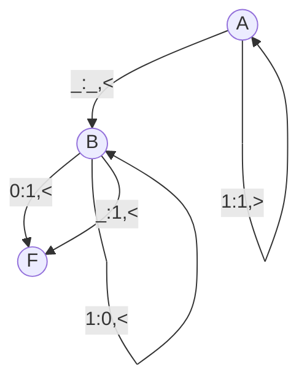
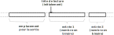

# TP - Machine de turing

Le concept de machine de Turing, inventé avant l'ordinateur, était censé représenter une personne virtuelle exécutant une procédure bien définie, en changeant le contenu des cases d'un ruban infini, en choisissant ce contenu parmi un ensemble fini de symboles.

Une machine de Turing comporte les éléments suivants :

- Un ruban infini divisé en cases consécutives. Chaque case contient un symbole d'un alphabet fini donné. L'alphabet contient un symbole spécial appelé « symbole blanc » (:octicons-square-24: dans les exemples qui suivent), et un ou plusieurs autres symboles. Le ruban est supposé être de longueur illimitée vers la gauche ou vers la droite, en d'autres termes la machine doit toujours avoir assez de longueur de ruban pour son exécution. On considère que les cases du ruban contiennent par défaut le « symbole blanc » ;
- Une tête de lecture/écriture qui peut lire et écrire les symboles sur le ruban, et se déplacer vers la gauche ou vers la droite du ruban ;
- Un registre d'état qui mémorise l'état courant de la machine de Turing. Le nombre d'états possibles est toujours fini, et il existe un état spécial appelé « état de départ » qui est l'état initial de la machine avant son exécution ;
- Une table d'actions qui indique à la machine :
  
    - quel symbole écrire sur le ruban
    - comment déplacer la tête de lecture (par exemple «:material-arrow-left:» pour une case vers la gauche, «:material-arrow-right:» pour une case vers la droite)
    - quel est le nouvel état, en fonction du symbole lu sur le ruban et de l'état courant de la machine
  
    Si aucune action n'existe pour une combinaison donnée d'un symbole lu et d'un état courant, la machine s'arrête.


!!! example "Un premier exemple simple"
    Définissons la machine de turing suivante:

    - alphabet : :octicons-square-24:, 0 et 1
    - la table d'action suivante (F correspond à un état final la machine s'arrête) :
    
    | état | lu | écrit | déplacement | suiv. |
    |---|---|---|---|---|
    | A | 0 | 1 | :material-arrow-right: | A |
    | A | 1 | 0 | :material-arrow-right: | A |
    | A | :octicons-square-24: | :octicons-square-24: | :material-arrow-right: | F |

    Appliquons cette machine au ruban suivant:

    |   | :material-arrow-down:  |   |   |   |   |
    |---|---|---|---|---|---|
    |   | 1 | 0 | 0 | 1 | :octicons-square-24: |

    On obtient alors :

    |   |   |   |   |   | :material-arrow-down:  |
    |---|---|---|---|---|---|
    |   | 0 | 1 | 1 | 0 | :octicons-square-24: |

    Par la suite on utilisera le simulateur suivant : [https://zanotti.univ-tln.fr/turing/turing.php](https://zanotti.univ-tln.fr/turing/turing.php). Il utilise une syntaxe simple. Par exemple, la table d'action précédente est alors écrite comme suit:

    ```
    A, : ,>,F
    A,0:1,>,A 
    A,1:0,>,A
    ```

!!! example "Exercice 1 : Lire et comprendre"
    Télécharger [ici](./data/turing2.txt) la table d'action suivante :

    ```
    A, : ,<,B
    A,0:0,>,A 
    A,1:1,>,A
    B,0:1,<,F
    B,1:0,<,B
    B, :1,<,F
    ```

    1. Faire fonctionner la machine de turing sur le ruban 11111 ou la tête de lecture est initialement sur le bit de poids le plus fort.
    2. Faire fonctionner la machine de turing sur le ruban 10011 ou la tête de lecture est initialement sur le bit de poids le plus fort.
    3. Analyser et comprendre l'opération réalisée par cette machine.

Le passage d'un état à un autre avec des règles peut être efficacement représenté par un graphe appelé *diagramme des transitions*.

<figure markdown>

</figure>


!!! example "Exercice 2 : Multiplier par deux"
    1. Donner la représentation binaire de 25 et 50. Puis de 6 et 12. Puis de 31 et 62. Que remarquez vous ?
    2. Ecrire la table d'action permettant de multipliser un nombre binaire par deux. Faire fonctionner la machine de Turing sur les exemples de la question 1.
    3. Réaliser le diagrammes des transitions de cette machine.

!!! example "Exercice 3 : Additionner deux nombres binaire"
    Ecrire la table d'action permettant de réaliser la somme de deux nombres binaires.

    Organisation sur le ruban:

    <figure markdown>
    
    </figure>