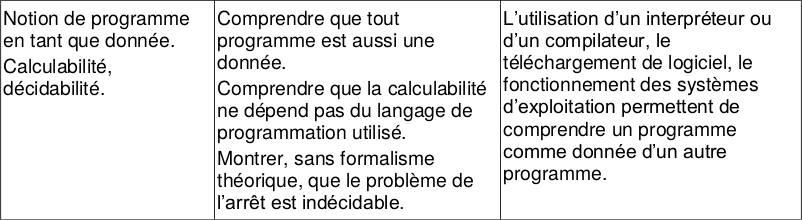

# Décidabilité, calculabilité
{: .center}

## 1. Un programme comme paramètre d'un programme

Les codes que nous manipulons ressemblent souvent à cela :

```python
def accueil(n):
    for k in range(n):
        print("bonjour")
```

Le programme s'appelle ```accueil```, et pour fonctionner il a besoin d'un paramètre, qui sera ici un nombre entier ```n```.

Maintenant, enregistrons le code suivant dans un fichier ```test.py``` :
```python
def accueil(n):
    for k in range(n):
        print("bonjour")

accueil(5)
```

Pour exécuter ce code, nous devons taper dans un terminal l'instruction suivante :
```python3 test.py```, ce qui donnera 
 
 ```bash
 user@computer : ~/$ python3 test.py
 bonjour
 bonjour
 bonjour
 bonjour
 bonjour
 ```

Le programme utilisé est alors ```python3```, qui prend comme paramètre le programme ```test.py```. Ce paramètre ```test.py``` est un ensemble de caractères qui contient les instructions que le programme ```python3``` va interpréter. 

Mais nous pouvons aller encore plus loin : l'instruction ```python3 test.py``` est tapée dans mon Terminal Linux, qui lui-même est un programme appelé ```Terminal```.


Conclusion :

!!! abstract "un programme est une donnée"
    **Un programme est une simple donnée, pouvant être reçue en paramètre par un autre programme.** (voire par lui-même !)


## 2. Un programme pour détecter l'arrêt d'un programme

> Je veux créer un programme qui détecte si un programme s'arrête (pas de boucle infinie).

### 2.1 Supposons qu'il existe

Supposons qu'une fonction python `detecte_arret` détecte l'arrêt des fonctions.


Elle fonctionne comme ceci:
```pycon
>>> detecte_arret(une_fonction)
True
```

### 2.2 Et passsons une fonction particulière en paramètre

Définissons maintenant la fonction `paradoxe` commme suit:

```python
def paradoxe():
    if detecte_arret(paradoxe):
        while True:
            print("Ah bah non")
    else:
        print("Ah bah je savais")
```

Que se passe-t-il si je fais l'appel `paradoxe()`:

- Si l'appel s'arrête, alors cela signifie que `detecte_arret(paradoxe)` devrait renvoyer `True`. Mais dans ce cas, on passe dans la première branche et on ne s'arrête jamais.
- Si l'appel ne s'arrête pas, cela signifie que `detecte_arret(paradoxe)` devrait renvoyer `False`. Mais dans ce cas, on passe dans la deuxième branche et le programme s'arrête.

**Ceci est absurde, nous démontrons ici que la fonction `detecte_arret` ne peut pas exister en Python.**

:material-arrow-right-bottom: Mais est-ce lié au langage python ? Pourrions nous trouver une solution dans un autre langage ? Ou avons nous touché quelque limite plus fondamentale ?

## 3. Calculabilité

Pour répondre à cette question, il est nécessaire de s'intéresser à l'ensemble de ce que peut faire un algorithme. C'est la question de la **calculabilité**.

### 3.1 Notion de calculabilité

Qu'y a-t-il derrière cette notion de calculabilité ?
Cette notion, qui jette un pont entre les mathématiques (la vision de [Alonzo Church](https://fr.wikipedia.org/wiki/Alonzo_Church), pour schématiser) et l'informatique (la vision de [Alan Turing](https://fr.wikipedia.org/wiki/Alan_Turing)) n'est pas simple à définir !

Le *calcul* mathématique peut se réduire à une succession d'opérations élémentaires (songez à la multiplication entière comme une série d'additions). Les nombres calculables sont les nombres qui sont générables en un nombre fini d'opérations élémentaires. 
De la même manière, une fonction mathématique sera dite calculable s'il existe une suite finie d'opérations élémentaires permettant de passer d'un nombre x à son image f(x).

On retrouve cette notion d'opérations élémentaires dans les [machines de Turing](https://fr.wikipedia.org/wiki/Machine_de_Turing){. target="_blank"}. 
Cette machine (théorique) permet de simuler tout ce qu'un programme informatique (une suite d'instructions) est capable d'exécuter. Un algorithme peut se réduire à une suite d'opérations élementaires, comme une fonction mathématique peut se réduire à une suite de calculs.
Dès lors, on pourra considérer un algorithme comme une fonction.
 
Turing a démontré que l'ensemble des fonctions calculables, au sens de Church, était équivalent à l'ensemble des fonctions programmables sur sa machine.
Certaines fonctions peuvent être calculables, *ou ne pas l'être* : c'est notamment le cas de notre fonction du problème de l'arrêt. 

### 3.2 Langages Turing-complets

Ce résultat ne dépend pas du langage utilisé : le fait que nous ayons utilisé Python au paragraphe précédent n'a pas d'influence sur notre démonstration. Nous savons depuis les machines de Turing que tous nos langages de programmation sont **Turing-complets** : ils sont tous capables de faire la même chose (avec plus ou moins de facilité !). 
Scratch, C, Python, Java, Basic, Haskell, Brainfuck... tous ces langages sont théoriquement équivalents.

!!! abstract "Langages Turing-complets"
    **La calculabilité ne dépend pas du langage utilisé**

## 4. Décidabilité

Ainsi notre programme ```detecte_arret```, censé prédire si une fonction ```fonction``` peut s'arrêter **NE PEUT PAS EXISTER** ni python ni dans n'importe quel autre langage de programmation.

Ce résultat théorique qui s'étend à **tous les langages** est d'une importance cruciale, s'appelle **le problème de l'arrêt**.

!!! note "Problème de l'arrêt :heart: :heart: :heart:"
    Il **ne peut pas exister** de programme universel qui prendrait en entrées :

    - un programme P 
    - une entrée E de ce programme P
    
    et qui déterminerait si ce programme P, lancé avec l'entrée E, va s'arrêter ou non. 


Ce résultat met un terme au rêve du mathématicien allemand [David Hilbert](https://fr.wikipedia.org/wiki/David_Hilbert){. target="_blank"}, qui avait en 1928 posé la question de l'existence d'un algorithme capable de répondre «oui» ou «non» à n'importe quel énoncé mathématique posé sous forme décisionnelle («un triangle rectangle peut-il être isocèle ?», «existe-t-il un nombre premier pair ?»)

Cette question, appelée «problème de la décision», ou *Entscheidungsproblem* en allemand, est définitivement tranchée par le problème de l'arrêt : un tel théorème ne peut pas exister, puisque par exemple, aucun algorithme ne peut répondre «oui» ou «non» à la question «ce programme va-t-il s'arrêter ?».

!!! abstract "Décidacilité"
    On appelle :

    - décidable un problème de décision (dont la réponse est oui ou non) dont la solution est calculable.
    - indécidable un problème de décision dont la solutino n'est pas calculable.


!!! note "Décidabilité et calculabilité"
    Le problème de l'arrêt est dit **indécidable** car la fonction qui le résout n'est pas **calculable**. 


---
## Bibliographie
- Numérique et Sciences Informatiques, Terminale, T. BALABONSKI, S. CONCHON, J.-C. FILLIATRE, K. NGUYEN, éditions ELLIPSES.
- [https://glassus.github.io/terminale_nsi/T2_Programmation/2.3_Calculabilite_Decidabilite/cours/](https://glassus.github.io/terminale_nsi/T2_Programmation/2.3_Calculabilite_Decidabilite/cours/)


