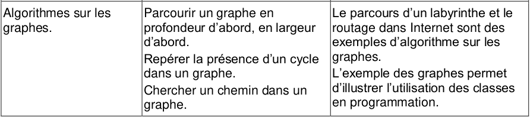

# Algorithmes sur les graphes

{: .center}

On rappelle ici l'interface d'un graphe:

| Opération | Description |
|---|---|
| ajouter_sommet(sommet) | Ajouter un sommet nommé *sommet* au graphe |
| ajouter_arc(sommet_debut, sommet_fin) | AJouter un arc orienté de sommet_debut à sommet_fin |
| arc(sommet_debut, sommet_fin) | Retoune True si un arc relie sommet_debut à sommet_fin |
| adjacents(sommet) | Retourne la liste des sommets adjacents accessibles |

## 1. Parcours en profondeur

**PRINCIPE**: Le principe d'un parcours en profondeur est de parcourir les sommets d'un graphe à partir d'un sommet en avançant toujours tant que l'on peut au sommet suivant.

**FONCTIONNEMENT**: L'exploration d'un parcours en profondeur depuis un sommet fonctionne comme suit:

- On poursuit un chemin dans le graphe jusqu'à un cul-de-sac ou alors jusqu'à atteindre un sommet déjà visité.
- On revient alors sur le dernier sommet où on pouvait suivre un autre chemin puis explore un autre chemin. 
- L'exploration s'arrête quand tous les sommets accessibles ont été visités.

**POINTS CLES**: La mise en place repose donc sur deux principes:

- Le **marquage** des sommets visités
- La **récursivité**

```python
def parcours_profondeur(graphe, sommet, lst_marque = [], lst_parcours = []):
    if sommet not in lst_marque:
        lst_marque.append(sommet)
        lst_parcours.append(sommet)
        for sommet_adjacent in graphe.adjacents(sommet):
            parcours_profondeur(graphe, sommet_adjacent, lst_marque, lst_parcours)
    return lst_parcours
```

!!! example "Vidéo sur un graphe"
    <video controls>
    <source src="../data/graphe_profondeur.mp4" type="video/mp4">
    <p>Votre navigateur ne prend pas en charge les vidéos HTML5.
        Voici <a href="data/graphe_profondeur.mp4">un lien pour télécharger la vidéo</a>.</p>
    </video>

## 2. Parcours en largeur

**PRINCIPE**: Le principe d'un parcours en largeur est de visiter les sommets en augmentant la distance de un à chaque fois par rapport au sommet de départ.

**FONCTIONNEMENT**: L'exploration d'un graphe en largeur à partir d'un sommet fonctionne comme suit:

- On visite tous les sommets directements adjacents au sommet de départ
- Puis on visite les sommets adjacents aux premiers
- Et ainsi de suite en ne repassant jamais par un sommet déjà visité

**POINTS CLEFS**:

- Le **marquage** des sommets visités
- Une **file** à mettre à jour des sommets à visiter

```python
def parcours_largeur(graphe, depart):
    lst_marque, lst_parcours, lst_a_parcourir = [], [], [depart]
    while len(lst_a_parcourir) != 0:
        sommet = lst_a_parcourir.pop(0)
        lst_marque.append(sommet)
        lst_parcours.append(sommet)
        for sommet_adjacent in graphe.adjacents(sommet):
            if sommet_adjacent not in lst_marque and sommet_adjacent not in lst_a_parcourir:
                lst_a_parcourir.append(sommet_adjacent)
    return lst_parcours
```

## 3. Chercher un chemin dans un graphe

**PRINCIPE**: Pour savoir si un chemin existe dans un graphe entre un sommet de départ et un sommet d'arrivée, il suffit de regarder si on atteint le sommet d'arriveé dans le parcours du graphe en partant du sommet de départ.

```python
def chemin(graphe, depart, arrivee):
    return arrivee in parcours_profondeur(graphe, depart)
```


## 4. Repérer la présence d'un cycle

**PRINCIPE**: Pour repérer un cycle dans un graphe il faut le parcourir en profondeur et vérifier, si l'on retombe sur un sommet déjà visité, que ce sommet est en cours de parcours (cycle) ou fini d'être parcouru (pas cycle).

**FONCTIONNEMENT**: On va utiliser la méthode du parcours en profondeur ajoutant un marquage particulier:

- BLANC : non visité
- GRIS : visité une seule fois
- NOIR : visité deux fois

```python
def cycle_sommet(graphe, sommet, dict_marque = None):
    """existence d'un cycle à partir d'un sommet"""
    if dict_marque is None:
        dict_marque = {s : 'BLANC' for s in graphe.sommets()}
    if dict_marque[sommet] == 'GRIS':
        return True
    if dict_marque[sommet] == 'NOIR':
        return False
    dict_marque[sommet] = 'GRIS'
    for sommet_adjacent in graphe.adjacents(sommet):
        if cycle_sommet(graphe, sommet_adjacent, dict_marque):
            return True
    dict_marque[sommet] == 'NOIR'
    return False
```

Pour reprérer un cycle dans un graphe, il suffit maintenant de chercher des cycles à partir de chacun de ses sommets.