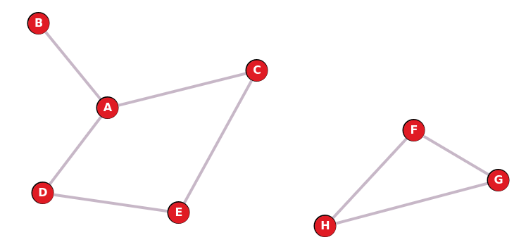
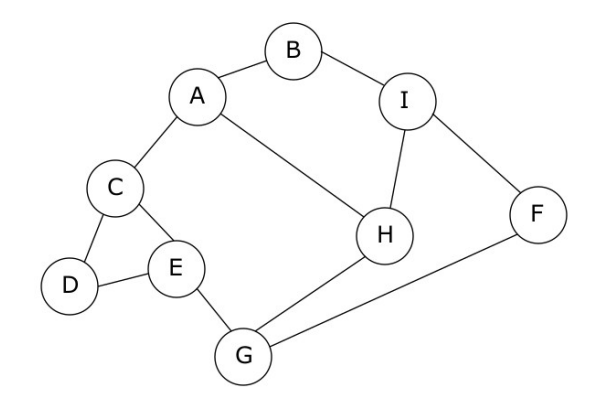

# TD

{{ initexo(0) }}

!!! example "{{ exercice() }}"
    === "Énoncé" 
        1. Effectuer un parcours BFS sur le graphe ci-dessous, en prenant le sommet C comme sommet de départ. Que remarque-t-on?

             

        2. Écrire une fonction (ou une méthode) `#!py est_connexe` qui détermine si un graphe est connexe ou non.

    === "Correction" 
        {{ correction(False, 
        "
        1. On obtient C, A, E, B, D. Le parcours ne visite que les sommets de la composante connexe du graphe contenant le sommet de départ, mais pas les sommets F, G et H.

        2. On utilise le fait que si le graphe est connexe, alors le parcours BFS visitera **tous** les sommets du graphe, c'est-à-dire que la longueur de la liste renvoyée par le parcours BFS sera de longueur égale à l'ordre du graphe...

            ```python linenums='1'
            def est_connexe(g:Graphe) -> bool:
                depart = g.sommets()[0]
                parcours = BFS(g, depart)
                return g.ordre() == len(parcours)
            ```
        
            **Remarque:** dans la fonction précédente, il faut que le graphe soit non vide pour pouvoir prendre l'élément d'indice 0 dans la liste des sommets de `#!py g`. Si on considère qu'un graphe vide est connexe (un seul morceau... vide), alors on peut écrire:

            ```python linenums='1'
            def est_connexe(g:Graphe) -> bool:
                if len(g.sommets()) == 0:
                    return True
                depart = g.sommets()[0]
                parcours = BFS(g, depart)
                return g.ordre() == len(parcours)
            ```

        "
        ) }}

!!! example "{{ exercice() }}"
    === "Énoncé" 
        !!! info "Rappel"
            Un graphe est **eulérien** s'il est connexe et s'il possède exactement 0 ou 2 sommets de degré impair (le degré de sommet est son nombre de voisins).

        Écrire une fonction (ou une méthode) `#!py est_eulerien` qui détermine si un graphe est eulérien ou non.

    === "Correction" 
        {{ correction(False, 
        "
        ```python linenums='1'
        def est_eulerien(g:Graphe) -> bool:
            degre_impair = 0
            for s in g.sommets():
                if len(g.voisins()) % 2 == 1:
                    degre_impair +=1
            return est_connexe(g) and (degre_impair == 0 or degre_impair == 2)
        ```
        "
        ) }}


!!! example "{{ exercice() }}"
    === "Énoncé" 
        Si un graphe orienté est connexe, la fonction `#!py detection_cycle` déterminera s'il contient ou non un cycle. En revanche, si le graphe n'est pas connexe, on ne sera pas capable de détecter un cycle dans une autre composante connexe que celle à laquelle appartient le sommet de départ.

        Écrire une fonction `#!py cycle` qui prend un paramètre un graphe orienté (de classe `#!py GrapheO` ) et qui renvoie si le graphe contient un cycle.
    === "Correction" 
        {{ correction(False, 
        "
        "
        ) }}

!!! example "{{ exercice() }}: Type bac"
    === "Énoncé" 

        La société CarteMap développe une application de cartographie-GPS qui permettra aux automobilistes de définir un itinéraire et d’être guidés sur cet itinéraire. Dans le cadre du développement d’un prototype, la société CarteMap décide d’utiliser une carte fictive simplifiée comportant uniquement 7 villes : A, B, C, D, E, F et G et 9 routes (toutes les routes sont considérées à double sens).

        Voici une description de cette carte :

        - A est relié à B par une route de 4 km de long ;
        - A est relié à E par une route de 4 km de long ;
        - B est relié à F par une route de 7 km de long ;
        - B est relié à G par une route de 5 km de long ;
        - C est relié à E par une route de 8 km de long ;
        - C est relié à D par une route de 4 km de long ;
        - D est relié à E par une route de 6 km de long ;
        - D est relié à F par une route de 8 km de long ;
        - F est relié à G par une route de 3 km de long.

        1. Représenter ces villes et ces routes sur sa copie en utilisant un graphe pondéré, nommé G1.
        2. Déterminer le chemin le plus court possible entre les villes A et D.
        3. Définir la matrice d’adjacence du graphe G1 (en prenant les sommets dans l’ordre alphabétique).
        
        Dans la suite de l’exercice, on ne tiendra plus compte de la distance entre les
        différentes villes et le graphe, non pondéré et représenté ci-dessous, sera utilisé :

        <figure markdown>
        
        </figure>

        Chaque sommet est une ville, chaque arête est une route qui relie deux villes.

        4. Proposer une implémentation en Python du graphe G2 à l’aide d’un dictionnaire.
        5. Proposer un parcours en largeur du graphe G2 en partant de A.

        La société CarteMap décide d’implémenter la recherche des itinéraires permettant de traverser le moins de villes possible. Par exemple, dans le cas du graphe G2, pour aller de A à E, l’itinéraire A-C-E permet de traverser une seule ville (la ville C), alors que l’itinéraire A-H-G-E oblige l’automobiliste à traverser 2 villes (H et G).
        
        Le programme Python suivant a donc été développé (programme p1) :

        ```python
        tab_itineraires=[]

        def cherche_itineraires(G, start, end, chaine=[]):
            chaine = chaine + [start]
            if start == end:
                return chaine
            for u in G[start]:
                if u not in chaine:
                    nchemin = cherche_itineraires(G, u, end, chaine)
                    if len(nchemin) != 0:
                        tab_itineraires.append(nchemin)
            return []
    
        def itineraires_court(G,dep,arr):
            cherche_itineraires(G, dep, arr)
            tab_court = ...
            mini = float('inf')
            for v in tab_itineraires:
                if len(v) <= ... :
                    mini = ...
            for v in tab_itineraires:
                if len(v) == mini:
                    tab_court.append(...)
            return tab_court
        ```

        La fonction itineraires_court prend en paramètre un graphe G, un sommet de départ dep et un sommet d’arrivée arr. Cette fonction renvoie une liste Python contenant tous les itinéraires pour aller de dep à arr en passant par le moins de villes possible.

        Exemple (avec le graphe G2) :

        ```python
        itineraires_court(G2, 'A', 'F')
        >>> [['A', 'B', 'I', 'F'], ['A', 'H', 'G', 'F'], ['A', 'H', 'I', 'F']]
        ```

        On rappelle les points suivants :

        - la méthode append ajoute un élément à une liste Python ; par exemple, tab.append(el) permet d’ajouter l’élément el à la liste Python tab ;
        - en python, l’expression ['a'] + ['b'] vaut ['a', 'b'] ;
        - en python float('inf') correspond à l’infini.

        6. Expliquer pourquoi la fonction cherche_itineraires peut être qualifiée de fonction récursive.
        7. Expliquer le rôle de la fonction cherche_itineraires dans le programme p1.
        8. Compléter la fonction itineraires_court.

        Les ingénieurs sont confrontés à un problème lors du test du programme p1. Voici les résultats obtenus en testant dans la console la fonction itineraires_court deux fois de suite (sans exécuter le programme entre les deux appels à la fonction itineraires_court) :

        ```python
        exécution du programme p1

        >>> itineraires_court(G2, 'A', 'E')
        [['A', 'C', 'E']]

        >>> itineraires_court(G2, 'A', 'F')
        [['A', 'C', 'E']]
        ```

        alors que dans le cas où le programme p1 est de nouveau exécuté entre les 2 appels
        à la fonction itineraires_court, on obtient des résultats corrects :

        ```python
        exécution du programme p1

        >>> itineraires_court(G2, 'A', 'E')
        [['A', 'C', 'E']]

        exécution du programme p1

        >>>itineraires_court(G2, 'A', 'F')
        [['A', 'B', 'I', 'F'], ['A', 'H', 'G', 'F'], ['A', 'H', 'I',
        'F']]
        ```

        9. Donner une explication au problème décrit ci-dessus. Vous pourrez vous
        appuyer sur les tests donnés précédemment
        
    === "Correction" 
        {{ correction(False, 
        """
        """
        ) }}

!!! pydefi "Pydéfis sur les graphes"
    - [Voyage en Fangorn](https://pydefis.callicode.fr/defis/Fangorn/txt){:target="_blank"}
    - [L'affaire Cicéron](https://pydefis.callicode.fr/defis/Ciceron/txt){:target="_blank"}
    - [SW VI : Les Ewoks sont tous copains](https://pydefis.callicode.fr/defis/AmisEwoks/txt){:target="_blank"}
    - [Fouinette donne l'alerte](https://pydefis.callicode.fr/defis/CriFouinette/txt){:target="_blank"}
    - [SW II : À la recherche du système Kamino](https://pydefis.callicode.fr/defis/RechercheKamino/txt){:target="_blank"}
