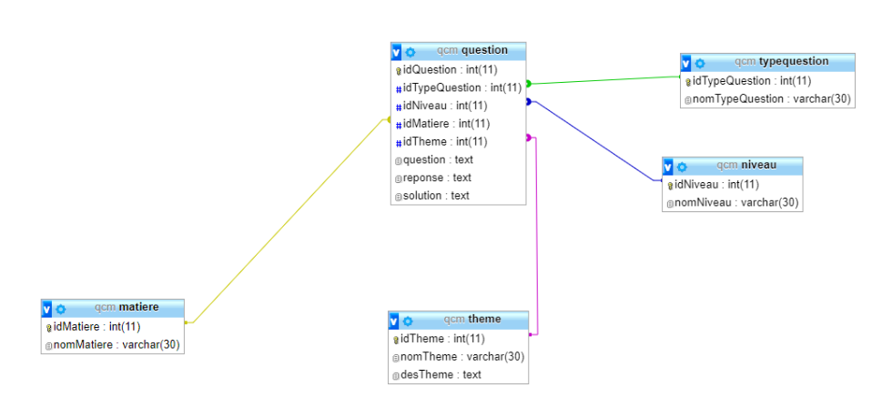

# Exercices sur le modèle relationnel

{{initexo(0)}}


!!! example "{{ exercice() }}"
    === "énoncé"
        On souhaite modéliser un annuaire téléphonique simple dans lequel chaque personne (identifiée par son nom et son prénom) est associée à son numéro de téléphone. Proposer une modélisation relationnelle de cet annuaire.

    === "corrigé"
        annuaire(Nom: chaine, Prénom: chaine, <u>Numéro</u>: entier ou chaine)


!!! example "{{ exercice() }} : Bulletin"
    === "énoncé"
        Donner la modélisation relationnelle d'un bulletin scolaire. Cette dernière doit permettre de mentionner:

        - des élèves, possédants un numéro d'étudiant alphanumérique unique
        - un ensemble de matières fixées, mais qui ne sont pas données
        - au plus une note sur 20, par matière et par élève. 

        On prendra soin de préciser toutes les contraintes utilisateurs qui ne peuvent êtres inscrites dans les schémas des relations.

    === "corrigé"

        Eleves(<u>num_etudiant</u>: chaine, Nom: chaine, Prénom: chaine)

        Matieres(<u>Nom_matiere</u>: chaine)

        Notes(<u>num_etudiant => Eleves, Nom_matiere => Matieres</u>, Note: Flottant)


!!! example "{{ exercice() }} : Des erreurs"
    === "énoncé"
        On propose un tableau qui donne les enregistrements d'une relation Joueur définie par le schéma relationnel : 

        Joueur(<u>IdJoueur</u>:Entier,nomJoueur:Chaîne,pNomJoueur:Chaîne,dNaissanceJoueur:Date)

        |IdJoueur	|nomJoueur	|pNomJoueur	|dNaissanceJoueur|
        |--|--|--|--|
        |1	|Terez	|Pascual	|124|
        |1	|Gosse	|452	| |
        |4	|Terez	|Pascual|	124|

        Repérez les anomalies dans ces enregistremenrs. Quelles sont les contraintes non respectées et/ou à mettre en œuvre ?
    
    === "corrigé"

        - Deux enregistrements avec la même clé primaire
        - Les dates de dNaissanceJoueur sont hors domaine
        - 452 (si c'est bien un entier) est hors domaine

!!! example "{{ exercice() }}"
    === "énoncé"
        *(d'après Prépabac NSI, Terminale, G.CONNAN, V.PETROV, G.ROZSAVOLGYI, L.SIGNAC, éditions HATIER.)*

        Deux relations modélisent la flotte de voitures d'un réseau de location de voitures.

        **Agences**

        | id_agence | ville     | département |
        |-----------|-----------|-------------|
        | 1         | Paris     | 75          |
        | 2         | Lyon      | 69          |
        | 3         | Marseille | 13          |
        | 4         | Aubagne   | 13          |


        **Voitures**

        | id_voiture | marque  | modèle | kilométrage | couleur | id_agence |
        |------------|---------|--------|-------------|---------|-----------|
        | 1          | Renault | Clio   | 12000                | Rouge   | 2         |
        | 2          | Peugeot | 205    | 22000       | Noir    | 3         |
        | 3          | Toyota  | Yaris  | 33000       | Noir    | 3         |


        1. Combien la relation ```Voitures``` comporte-t-elle d'attributs ?
        2. Combien d'enregistrements y a-t-il dans la relation `Voitures` ?
        3. Quel est le domaine de l'attribut ```id_agence```  dans la relation ```Voitures``` ?
        4. Quel est le schéma relationnel de la relation ```Agences ``` ?
        5. Quelle est la clé primaire de la relation ```Agences ``` ?
        6. Quelle est la clé primaire de la relation ```Voitures ``` ?
        7. Quelle est la clé étrangère de la relation ```Voitures ``` ?

    === "Correction"

        8. 6
        9. 3
        10. Entier (```Int``` )
        11. Agences(<u>id_agence</u> : entier, ville : chaine, département : entier)
        12. ```id_agence``` 
        13. ```id_voiture``` 
        14. ```id_agence``` 


!!! example "{{ exercice() }}"
    === "énoncé"
        Prenons la base du tour de France 2020:


        **relation Équipes**

        | codeEquipe | nomEquipe                           |
        |------|-----------------------------|
        | ALM  |  AG2R La Mondiale           |
        | AST  |  Astana Pro Team            |
        | TBM  |  Bahrain - McLaren          |
        | BOH  |  BORA - hansgrohe           |
        | CCC  |  CCC Team                   |
        | COF  |  Cofidis, Solutions Crédits |
        | DQT  |  Deceuninck - Quick Step    |
        | EF1  |  EF Pro Cycling             |
        | GFC  |  Groupama - FDJ             |
        | LTS  |  Lotto Soudal               |
        | ...  | ...                         |


        **relation Coureurs**

        | dossard | nomCoureur  | prénomCoureur | codeEquipe |
        |---------------|-------------|---------------|------------|
        | 141           | LÓPEZ       | Miguel Ángel  | AST        |
        | 142           | FRAILE      | Omar             | AST        |
        | 143           | HOULE       | Hugo          | AST        |
        | 11            | ROGLIČ      | Primož        | TJV        |
        | 12            | BENNETT     | George        | TJV        |
        | 41            | ALAPHILIPPE | Julian        | DQT        |
        | 44            | CAVAGNA     | Rémi          | DQT        |
        | 45            | DECLERCQ    | Tim           | DQT        |
        | 121           | MARTIN      | Guillaume     | COF        |
        | 122           | CONSONNI    | Simone        | COF        |
        | 123           | EDET        | Nicolas       | COF        |
        | …             | …           | …             | …          |


        **relation Étapes**

        | numéroEtape | villeDépart | villeArrivée      | km  |
        |-------------|-------------|-------------------|-----|
        | 1           | Nice        | Nice              | 156 |
        | 2           | Nice        | Nice              | 185 |
        | 3           | Nice        | Sisteron          | 198 |
        | 4           | Sisteron    | Orcières-Merlette | 160 |
        | 5           | Gap         | Privas            | 198 |
        | ...         | ...         | ...               | ... |


        **relation Temps**

        | dossard | numéroEtape | tempsRéalisé |
        |:-------------:|:-----------:|:------------:|
        | 41            | 2           | 04:55:27     |
        | 121           | 4           | 04:07:47     |
        | 11            | 5           | 04:21:22     |
        | 122           | 5           | 04:21:22     |
        | ...           | ...         | ...          |


        


        1. Quel temps a réalisé Guillaume MARTIN sur l'étape Sisteron / Orcières-Merlette ?
        2. À l'arrivée à Privas, qui est arrivé en premier entre Primož ROGLIČ et Simone CONSONNI ?

    === "Correction"

        3. Temps de Guillaume Martin (dossard 121): 04:07:47
        4. Aucun des deux, ils sont arrivés dans le même temps (04:21:22)


!!! example "{{ exercice() }}"
    === "énoncé"
        Voici comment le logiciel phpMyadmin représente les bases de données:
        

        1. Repérez les différentes relations.
        2. Repérez les clés primaires et les clés étrangères de la relation question.
        3. Repérez les domaines des différents attributs de cette relation question.

    === "corrigé"

        1. matière, question, theme, typequestion, niveau
        2.  clé primaire : idQuestion
   
            clé étrangères : idTypeQuestion, idNiveau, idMatiere, idTheme
        3. idQuestion : entier

            idTypeQuestion : entier

            idNiveau : entier

            idMatiere : entier

            idTheme : entier

            question : chaine

            reponse : chaine

            solution : chaine


!!! example "{{ exercice() }}"
    === "énoncé"

        On considère la table Films suivante :

        | Titre | Annee | Realisateur | Note | NbAavis | Duree | Type |
        | --- | --- | --- | --- | --- | --- | --- |
        | Apocalypse Now | 1979 | Francis Ford Coppola | 8,4 | 578150 | 2h27 | Drama, Mystery, War |
        | Full Metal Jacket | 1987 | Stanley Kubrick | 8,3 | 644089 | 1h56 | Drama, War |
        | Scarface | 1983 | Brian De Palma | 8,3 | 704025 | 170 min | Crime, Drama |
        | Orange mécanique | 1971 | S. Kubrick | 8,3 | 725846 | 136' | Crime, Drama, Sci-Fi |
        | 2001, l'odyssée de l'espace | 1968 | Kubrick | 8,3 | 574171 | 2h29 | Adventure, Science fiction |
        | Taxi Driver | 1976 | Martin Scorsese | 8,3 | 685042 | 1h54 | Crime, Drama |
        *source https://www.imdb.com*

        1. Proposer une structure conforme au modèle relationnel pour ces données.
        2. Donner le contenu de chacune des tables.

    === "corrigé"
        1. Film(<u>idFilm</u> : entier, Titre : chaine, Annee : entier, #idRealisateur :entier ==> Realisateur, Note : reel, NbAvis : entier, Duree : entier)

            Realisateur(<u>idRealisateur</u> : entier, Nom : chaine, Prenom : chaine)

            Type(<u>Theme : chaine, #idFilm ==> Film</u>)

            **OU**

            Film(<u>idFilm</u> : entier, Titre : chaine, Annee : entier, #idRealisateur :entier ==> Realisateur, Duree : entier)

            Realisateur(<u>idRealisateur</u> : entier, Nom : chaine, Prenom : chaine)

            Type(<u>idType: entier</u>, theme: chaine)

            LienFilmType(<u>#idType ==> Type, #idFilm ==> Film</u>)

            Avis(<u>idAvis</u>, #idFilm ==> Film, Note : entier, Commentaire: chaine)


        2. Si on prend la modélisation 1

            | idFilm | Titre | Annee | idRealisateur | Note | NbAavis | Duree |
            |---| --- | --- | --- | --- | --- | --- | --- |
            | 1 | Apocalypse Now | 1979 | 1 | 8,4 | 578150 | 2h27 |
            | 2 | Full Metal Jacket | 1987 | 2 | 8,3 | 644089 | 1h56 | 
            | 3 | Scarface | 1983 | 3 | 8,3 | 704025 | 170 min |
            | 4 | Orange mécanique | 1971 | 2 | 8,3 | 725846 | 136' | 
            | 5 | 2001, l'odyssée de l'espace | 1968 | 2 | 8,3 | 574171 | 2h29 | 
            | 6 | Taxi Driver | 1976 |4 | 8,3 | 685042 | 1h54 | 

            | idRealisateur | Nom | Prenom |
            |---| --- | --- |
            | 1 | Coppola | Francis Ford | 
            | 2 | Kubrick | Stanley |
            | 3 | De Palma | Brian  | 
            | 4 | Scorsese| Martin  | 

            | Type | idFilm |
            |---|---|
            | Drama | 1 |
            | Mystery | 1 |
            | War | 1 |
            | Drama | 2 |
            | War | 2 |
            | Crime | 3 |
            | Drama | 3 |
            | Crime | 4 |
            | Drama | 4 |
            | Sci-Fi | 4 |
            | Adventure | 5 |
            | Science fiction | 5 |
            | Crime | 6 |
            | Drama | 6 |


