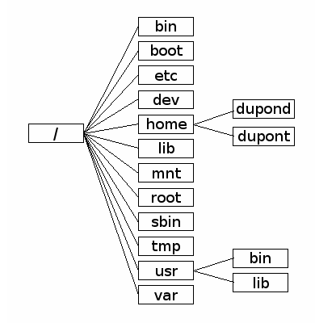

# TP

## GNU Linux

Un système d'exploitation (souvent appelé OS — de l'anglais operating system) est un ensemble de programmes qui dirige l'utilisation des ressources d'un ordinateur par des logiciels applicatifs.

La désignation open source s'applique aux logiciels (et s'étend maintenant aux œuvres de l'esprit) dont la licence respecte des critères précisément établis par l'Open Source Initiative, c'est-à-dire les possibilités de libre redistribution, d'accès au code source et de création de travaux dérivés. Mis à la disposition du grand public, ce code source est généralement le résultat d'une collaboration entre programmeurs.

Unix, officiellement UNIX, est une famille de systèmes d'exploitation multitâche et multi-utilisateur dérivé de l'Unix d'origine créé par AT&T, le développement de ce dernier ayant commencé dans les années 1970 au centre de recherche de Bell Labs mené par Kenneth Thompson. Il repose sur un interpréteur ou superviseur (le shell) et de nombreux petits utilitaires, accomplissant chacun une action spécifique, commutables entre eux (mécanisme de « redirection ») et appelés depuis la ligne de commande

Un système d’exploitation de type Unix (en anglais : Unix-like) est un système d’exploitation qui se comporte d’une façon semblable à un système Unix.

Linux ou GNU/Linux — plus rarement GNU+Linux4 — est une famille de systèmes d'exploitation open source de type Unix fondés sur le noyau Linux créé en 1991 par Linus Torvalds. De nombreuses distributions Linux ont depuis vu le jour et constituent un important vecteur de popularisation du mouvement du logiciel libre.

En 2023:

- environ 80% des serveurs web fonctionnent sur Linux
- la totalité des super ordinateurs fonctionnent sur Linux
- la quasi totalité des smartphones fonctionnent sur des OS de type Unix (iOS ou android)
- Mais seulement 30% des ordinateurs fonctionnent sur des OS de type Unix (MacOS ou Linux)


## L'arborescence d'un disque dur
Les systèmes Unix (MacOS ou GNU/Linux) organisent leur disque dur suivant l'arborescence ci-dessous :
<figure markdown>



</figure>

{{ initexo(0) }}


!!! example "{{ exercice() }}"
    === "énoncé"
        Quelque part à l'intérieur des dossiers contenus dans l'archive [dossiers.zip](./data/dossiers.zip) se trouve un fichier ```tresor.txt```. Quel secret renferme-t-il ?

        Attention, cette recherche est à faire uniquement en ligne de commande :

        - ```ls``` : pour lister les dossiers et fichiers d'un répertoire
        - ```cd Dossier``` : pour se rendre dans le repértoire ```Dossier```
        - ```cd ..``` : pour remonter d'un niveau dans l'arborescence
        - ```unzip monarchive.zip``` : pour décompresser une archive
        - `cat monfichier` : pour afficher le contenu de `monfichier`
        - ```tree``` : pour afficher l'arborescence du répertoire courant
        - ```sudo apt install monprog``` : pour installer le programme ```monprog``` si celui-ci est manquant.

        1. Sur un PC du lycée, ouvrir l'application ubuntu. Ubuntu est une distribution Linux et peut fonctionner dans une machine virtuelle dans windows.
        2. récupérer le fichier dossier.zip en tapant dans le shell : `wget https://terminale-nsi.vercel.app/T5_Architecture_materielle/5.0_Autour_de_GNU_Linux/data/dossiers.zip`
        3. décompresser l'archive et chercher le secret.