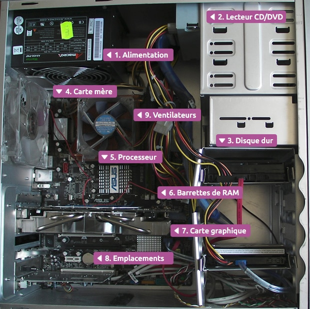
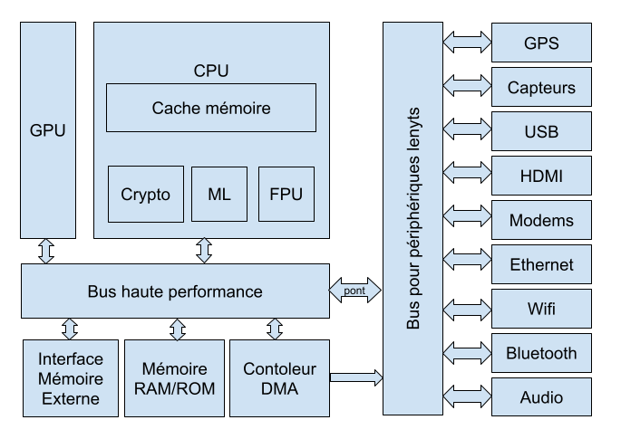

# Systèmes sur puce

{: .center}

*préambule : [cours de Première sur l'architecture Von Neumann](https://premiere-nsi.vercel.app/T5_Architectures_mat%C3%A9rielles/5.1_Von_Neumann/Cours/){. target="_blank"}*

## 1. Loi de Moore et miniaturisation progressive

### 1.1 La Loi de Moore
{: .center width=20%}

En 1965, Gordon Moore postule que le nombre de transistors présents sur une puce de microprocesseur doublera tous les deux ans.

Cette prédiction s'est révélée étonnamment juste (à quelques approximations près) et les équipements électroniques n'ont depuis jamais cessé de devenir toujours plus performants / miniatures / économes en énergie.

{: .center width=60%}

### 1.2  Évolution de la taille des ordinateurs

#### 1.2.1 IBM 650, le premier ordinateur fabriqué en série (1955)

{: .center width=50%}

Cet ordinateur n'a pas encore de transistors mais des tubes à vide.

#### 1.2.2 IBM 7090, le premier ordinateur à transistors (1959)

{: .center width=50%}

!!! info inline end "Le transistor"
    Le transistor est un composant électronique essentiel : il permet de laisser (ou non) passer un courant électrique.
    {: .center width=100%}
    

#### 1.2.3 Le rôle crucial de la taille des transistors
Ainsi que l'avait prédit Moore, c'est la progression du nombre de transistors gravables sur le processeur qui guidera pendant des années l'évolution de l'informatique :

{: .center width=70%}

## 2. Composition d'un pc actuel

{: .center width=50%}

Chaque composant a un rôle spécifique. Ils communiquent entre eux par des **bus** de différentes vitesses. Chaque composant est remplaçable, et il est possible d'ajouter de nouveaux composants sur la carte mère qui possède des slots d'extension.

## 3. Tout un pc sur une seule puce : les SoC

### 3.1 L'intégration de composants différents au sein d'une même puce

Le principe d'un **système sur puce** ou **System On a Chip** (SoC) est d'intégrer au sein d'une puce unique un ensemble de composants habituellement physiquement dissociés dans un ordinateur classique (ordinateur de bureau ou ordinateur portable).

On peut retrouver ainsi au sein d'une **même puce** :

- le microprocesseur (CPU)
- la carte graphique (GPU)
- la mémoire RAM

\+ éventuellement des composants de communication (WiFi, Bluetooth...)

Les SOC reposent sur une architecture proche de celle-ci:

{: .center width=50%}

!!! abstract "Avantages et inconvénients d'un SoC :heart:"
    :white_check_mark: **Avantages**

    - moindre consommation électrique
    - moindre encombrement
    - pas besoin de refroidissement
    - meilleure sécurité (vue globale sur la sécurité qui n'est plus dépendante d'une multitude de composants)
    - moindre coût (forte automisation du processus, gros volumes de production)

    :name_badge: **Inconvénients**

    - Impossibilité de choisir indépendamment ses composants
    - Pas de remplacement / ajout d'un composant
    - La panne d'un seul composant entraîne la panne totale du SoC

### 3.2 Exemple : Snapdragon 8 gen 3

Observons par exemple la puce Snapdragon 8 gen 3, qui équipe les Samsung Galaxy S24 Ultra. Cette puce concue par Qualcomm est fabriquée par l'entreprise Taiwanaise [TSMC](https://fr.wikipedia.org/wiki/Taiwan_Semiconductor_Manufacturing_Company){https://fr.wikipedia.org/wiki/Taiwan_Semiconductor_Manufacturing_Companyrget="_blank"} comme les puces Apple A16 Bionic.

Cette puce contient :

- 16 milliards de transistors (gravés à 4 nm)
- un processeur central à 8 cœurs (4 cœurs hautes performances + 4 cœurs plus économes en énergie)
- un GPU (processeur dédié uniquement au calcul du rendu graphique) de 2 cœurs.
- une puce dédiée au Machine Learning (*Neural Engine*)
- la prise en charge de la 5G, du wifi et du bluetooth.
- la fonctionnalité GPS

## 4. Des puces dédiées à des tâches spécifiques

L'intégration dans un SoC n'est pas totale : il reste des puces dédiées à des tâches très spécifiques qui ne sont pas forcément intégrées dans le SoC.

L'orientation actuelle de l'électronique est donc à la fois :

- une intégration toujours plus grande dans des SoC multi-tâches.
- des puces toujours plus spécifiques qui excellent dans un domaine particulier.

## 5. Exercice

!!! abstract "Exercice *(Polynésie 2021)*"
    === "Énoncé"
        Un constructeur automobile intègre à ses véhicules des systèmes embarqués, comme par exemple un système de guidage par satellites (GPS), un système de freinage antiblocage (ABS)... 

        Ces dispositifs utilisent des systèmes sur puces (SoC : System on a Chip).

        Citer deux avantages à utiliser ces systèmes sur puces plutôt qu'une architecture classique d'ordinateur.
    === "Correction"
         

??? quote "Bibliographie / Sitographie"
    - Numérique et Sciences Informatiques, Terminale, T. BALABONSKI, S. CONCHON, J.-C. FILLIATRE, K. NGUYEN, éditions ELLIPSES.
    - Prépabac NSI, Terminale, G.CONNAN, V.PETROV, G.ROZSAVOLGYI, L.SIGNAC, éditions HATIER.
    - [https://fr.wikipedia.org/wiki/Loi_de_Moore](https://fr.wikipedia.org/wiki/Loi_de_Moore){. target="_blank"}
    - [https://blog.iakaa.com/lordinateur-fete-ses-60-ans/](https://blog.iakaa.com/lordinateur-fete-ses-60-ans/){. target="_blank"}
    - [https://www.thewindowsclub.com/history-of-computers](https://www.thewindowsclub.com/history-of-computers){. target="_blank"}
    - [https://perso-etis.ensea.fr//lorandel/M2_SoC/s1.pdf](https://perso-etis.ensea.fr//lorandel/M2_SoC/s1.pdf){. target="_blank"}
    - [https://www.hawkpointtechnologies.com/about/blog/computer-components](https://www.hawkpointtechnologies.com/about/blog/computer-components){. target="_blank"}
    - [https://www.tremplin-numerique.org/apple-a15-vs-a14-quoi-de-neuf-dans-la-puce-de-liphone-13](https://www.tremplin-numerique.org/apple-a15-vs-a14-quoi-de-neuf-dans-la-puce-de-liphone-13){. target="_blank"}
    - [https://www.distrelec.be/fr/cryptoprocesseur-breakout-atecc608a-sparkfun-electronics-dev-18077/p/30241877](https://www.distrelec.be/fr/cryptoprocesseur-breakout-atecc608a-sparkfun-electronics-dev-18077/p/30241877){. target="_blank"}

