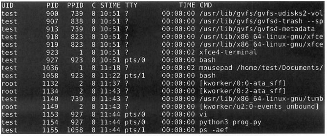
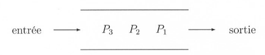
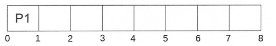
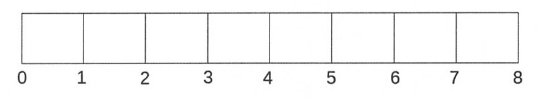
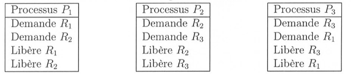

# TD

{{ initexo(0) }}

!!! example "{{ exercice() }}"
    === "énoncé"
        _2021, sujet Amérique du Nord_

        Un constructeur automobile utilise des ordinateurs pour la conception de ses véhicules.
        Ceux-ci sont munis d'un système d'exploitation ainsi que de nombreuses applications parmi lesquelles on peut citer :

        - un logiciel de traitement de texte ;
        - un tableur ;
        - un logiciel de Conception Assistée par Ordinateur (CAO) ;
        - un système de gestion de base de données (SGBD)

        Chaque ordinateur est équipé des périphériques classiques : clavier, souris, écran et est relié à une imprimante réseau.

        1. *(question System On Chip)*
        2. Un ingénieur travaille sur son ordinateur et utilise les quatre applications citées au début de l'énoncé.  
        Pendant l'exécution de ces applications, des processus mobilisent des données et sont en attente d'autres données mobilisées par d'autres processus.  
        On donne ci-dessous un tableau indiquant à un instant précis l'état des processus en cours d'exécution et dans lequel D1, D2, D3, D4 et D5 sont des données.

        La lettre M signifie que la donnée est mobilisée par l'application ; la lettre A signifie que l'application est en attente de cette donnée.

        Lecture du tableau : le logiciel de traitement de texte mobilise (M) la donnée D1 et est en attente (A) de la donnée D2.

        | | D1 | D2 | D3 | D4 | D5|
        |:---:|:---:|:---:|:---:|:---:|:---:|
        | Traitement de texte | M | A |-|-|-|
        | Tableur | A | - |-|-|M|
        | SGBD | - | M |A|A|-|
        | CAO | - | - |A|M|A|

        Montrer que les applications s'attendent mutuellement. Comment s'appelle cette situation ?

    === "correction"
        {{ correction(True,
        """
        {: .center}
        
        Le cycle en pointillés montre que les applications s\'attendent mutuellement : cette situation s\'appelle un interblocage.
        """
        )}}


!!! example "{{ exercice() }}"
    === "énoncé"
        _2021, Métropole sujet 1_

        **Partie A**
        Cette partie est un questionnaire à choix multiples (QCM).
        Pour chacune des questions, une seule des quatre réponses est exacte.

        1. Parmi les commandes ci-dessous, laquelle permet d’afficher les processus en cours
        d’exécution ?
            - a. ```dir```
            - b. ```ps``` 
            - c. ```man``` 
            - d.   ```ls```
        2. Quelle abréviation désigne l’identifiant d’un processus dans un système d’exploitation de type UNIX ?
            - a. PIX
            - b. SIG 
            - c. PID 
            - d. SID
        3. Comment s'appelle la gestion du partage de processeur entre les différents processus ?
            - a. L'interblocage
            - b. L'ordonnancement
            - c. La planification
            - d. La priorisation
        4. Quelle commande permet d’interrompre un processus dans un système d’exploitation de type
        UNIX ?
            - a. ```stop```
            - b. ```interrupt``` 
            - c. ```end``` 
            - d.   ```kill```

        {{ correction(True,
        """
        ??? tip \"correction\"
            1. b
            2. c
            3. b
            4. d
        """
        )}}
        

        **Partie B**

        **Q1.** Un processeur choisit à chaque cycle d’exécution le processus qui doit être exécuté. Le
        tableau ci-dessous donne pour trois processus P1, P2, P3 :

        - la durée d’exécution (en nombre de cycles),
        - l’instant d’arrivée sur le processeur (exprimé en nombre de cycles à partir de 0),
        - le numéro de priorité.

        Le numéro de priorité est d’autant plus petit que la priorité est grande. On suppose qu’à chaque instant, c’est le processus qui a le plus petit numéro de priorité qui est exécuté, ce qui peut provoquer la suspension d’un autre processus, lequel reprendra lorsqu’il sera le plus prioritaire.

        {: .center}
        Reproduire le tableau ci-dessous sur la copie et indiquer dans chacune des cases le processus
        exécuté à chaque cycle.
        {: .center}

        {{ correction(True,
        """
        ??? tip \"correction\"
            {: .center}
        """
        )}}
            


        **Q2.** On suppose maintenant que les trois processus précédents s’exécutent et utilisent une ou plusieurs ressources parmi R1, R2 et R3.
        Parmi les scénarios suivants, lequel provoque un interblocage ? Justifier.

        {: .center}
        
        {{ correction(True,
        """
        ??? tip \"correction\"
            {: .center}
            Seul le scenario 2 présente un cycle d'interdépendance : seul le scénario 2 va donc provoquer un interblocage.
        """
        )}}


!!! example "{{ exercice() }}"
    === "énoncé"
        _2021, Métropole sujet 2_

        **Partie A**

        Dans un bureau d’architectes, on dispose de certaines ressources qui ne peuvent être utilisées
        simultanément par plus d’un processus, comme l’imprimante, la table traçante, le modem.
        Chaque programme, lorsqu’il s’exécute, demande l’allocation des ressources qui lui sont
        nécessaires. Lorsqu’il a fini de s’exécuter, il libère ses ressources.

        {: .center}

        On appelle p1, p2 et p3 les processus associés respectivement aux programmes 1, 2 et 3

        **Q1.** Les processus s'exécutent de manière concurrente.
        Justifier qu'une situation d'interblocage peut se produire.

        {{ correction(True,
        """
        ??? tip \"correction\"
            Supposons que chaque ligne de chaque programme s'effectue consécutivement (d'abord la ligne 1 de P1, puis celle de P2, puis celle de P3, puis la ligne 2 de P1, etc.). Dans ce cas-là, le diagramme de dépendance serait :
            {: .center}
            On voit apparaître un cycle d'interdépendance : il peut donc y avoir une situation d'interblocage.
        """
        )}}

        **Q2**. Modifier l'ordre des instructions du programme 3 pour qu'une telle situation ne puisse pas se produire. Aucune justification n'est attendue.


        {{ correction(True,
        """
        ??? tip \"correction\"
            On peut par exemple inverser la demande d'imprimante et de table traçante.
        """
        )}}

        **Q3**. Supposons que le processus p1 demande la table traçante alors qu'elle est en cours
        d'utilisation par le processus p3. Parmi les états suivants, quel sera l'état du processus p1
        tant que la table traçante n'est pas disponible :

        - a. élu
        - b. bloqué
        - c. prêt
        - d. terminé

        {{ correction(True,
        """
        ??? tip \"correction\"
            Il sera à l'état bloqué.
        """
        )}}
            

        **Partie B**

        Avec une ligne de commande dans un terminal sous Linux, on obtient l'affichage suivant :

        {: .center}

        La documentation Linux donne la signification des différents champs :

        - `UID` : identifiant utilisateur effectif ;
        - `PID` : identifiant de processus ;
        - `PPID` : `PID` du processus parent ;
        - `C` : partie entière du pourcentage d'utilisation du processeur par rapport au temps de vie
        des processus ;
        - `STIME` : l'heure de lancement du processus ;
        - `TTY` : terminal de contrôle
        - `TIME` : temps d'exécution
        - `CMD` : nom de la commande du processus


        **Q1.** Parmi les quatre commandes suivantes, laquelle a permis cet affichage ?

        - a. ```ls -l``` 
        - b. ```ps -ef``` 
        - c. ```cd ..``` 
        - d. ```chmod 741 processus.txt``` 

        **Q2.** Quel est l'identifiant du processus parent à l'origine de tous les processus concernant le
        navigateur Web (chromium-browser) ?

        **Q3.** Quel est l'identifiant du processus dont le temps d'exécution est le plus long ?

        {{ correction(True,
        """
        ??? tip \"correction\"
            **Q1.** b.

            **Q2.** 831 est le parent de 6211 processus `chromium-browser` parent de tous les autres processus `chromium-browser`.

            **Q3.** 6211
        """
        )}}
            
!!! example "{{ exercice() }}"
    === "énoncé"
        _2021, Métropole Candidats Libres sujet 2_

        **Q1.** Les états possibles d’un processus sont : *prêt*, *élu*, *terminé* et *bloqué*.

        **Q1.a.** Expliquer à quoi correspond l’état *élu*.  
        **Q1.b.** Proposer un schéma illustrant les passages entre les différents états.

        {{ correction(False,
        """
        ??? tip \"correction\"
            **Q1a.** Élu signifie que le processus est actuellement en cours d'exécution par le processeur.

            **Q1b.** 
            {: .center}
        """
        )}}
            

        **Q2.** On suppose que quatre processus C₁, C₂, C₃ et C₄ sont créés sur un ordinateur,
        et qu’aucun autre processus n’est lancé sur celui-ci, ni préalablement ni pendant
        l’exécution des quatre processus.
        L’ordonnanceur, pour exécuter les différents processus prêts, les place dans une
        structure de données de type file. Un processus prêt est enfilé et un processus
        élu est défilé.
        


        **Q2.a.** Parmi les propositions suivantes, recopier celle qui décrit le fonctionnement
        des entrées/sorties dans une file :  

        - i.Premier entré, dernier sorti
        - ii. Premier entré, premier sorti
        - iii. Dernier entré, premier sorti

        {{ correction(False,
        """
        ??? tip \"correction\"
            **Q2a.** ii. Premier entré, premier sorti
        """
        )}}

        **Q2.b.** On suppose que les quatre processus arrivent dans la file et y sont placés
        dans l’ordre C₁, C₂, C₃ et C₄.

        - Les temps d’exécution totaux de C₁, C₂, C₃ et C₄ sont respectivement
        100 ms, 150 ms, 80 ms et 60 ms.
        - Après 40 ms d’exécution, le processus C₁ demande une opération d’écriture
        disque, opération qui dure 200 ms. Pendant cette opération d’écriture, le
        processus C₁ passe à l’état bloqué.
        - Après 20 ms d’exécution, le processus C₃ demande une opération d’écriture
        disque, opération qui dure 10 ms. Pendant cette opération d’écriture, le
        processus C₃ passe à l’état bloqué.


        Sur la frise chronologique ci-dessous, les
        états du processus C₂ sont donnés. Compléter la frise avec les états des
        processus C₁, C₃ et C₄.

        {: .center}

        {{ correction(False,
        """
        ??? tip \"correction\"
            {: .center}
        """
        )}}
            


!!! example "{{ exercice() }}"
    === "énoncé"
        Exercice 2 du sujet Amérique du Nord J2 2022

        Cet exercice pourra utiliser des commandes de système d'exploitation de type UNIX telles que `cd`, `ls`, `mkdir`, `rm`, `rmd`, `mv`, `cat`.

        1. Dans un système d'exploitation de type UNIX, on considère l'arborescence des fichiers suivante dans laquelle les noms de dossiers sont en italique et ceux des fichiers qui sont en gras :

            


            On souhaite, grâce à l'utilisation du terminal de commande, explorer et modifier les répertoires et fichiers présents.
            On suppose qu'on se trouve actuellement à l'emplacement `/home/morgane`

            1. Parmi les quatre propositions suivantes, donner celle correspondant à l'affichage obtenu lors se l'utilisation de la commande `ls`.

                - Proposition 1 : `lycee francais NSI info.txt image1.jpg perso`
                - Proposition 2 : `lycee perso`
                - Proposition 3 : `morgane`
                - Proposition 4 : `bin etc home tmp`

            2. Ecrire la commande qui permet, à partir de cet emplacement, d'attendre le répertoire lycee.
        
            On suppose maintenant qu'on se trouve dans le repertoire `/home/morgane/lycee/NSI`

            3. Ecrire la commande qui permet de créer à cet emplacement un répertoire nommé algorithmique.
            4. Ecrire la commande qui permet, à partir de cet emplacement, de supprimer le fichier `image1.jpg`.

        2. On rappelle qu'un processus est une instance d'application. Un processus peut être démarré par l'utilisateur, par un périphérique ou par un autre processus appelé parent.

            La commande UNIX pa présente un cliché instantané des procesus en cours d'exécution.

            On a exécuté la commande ps (avec quelques options qu'il n'est pas nécessaire de connaître pour la réussite de cet exercice). Un extrait du résultat de la commande est présenté ci-dessous :

            <figure markdown>
            
            </figure>

            On rappelle que :

            - l'UID est l'identifiant de l'utilisateur propriétaire du processus;
            - le PID est l'identifiant du processus parent;
            - le PPID est l'identifiant du provessus parent;
            - C indique l'utilisation processeur;
            - STIME est l'heure de démarrage du processus;
            - TTy est le nom du terminal de commande auquel le processus est attaché;
            - TIME est la durée d'utilisation du processus par le processeur;
            - CMD le nom de commande utilisé pour démarrer le processus.

            1. Donner le PID du parent du processus démarré par la commande `vi`.
            2. Donner le PID d'un processus enfant du processus démarré par la commande `xfce4-terminal`.
            3. Citer le PID de deux processus qui ont le même parent.
            4. Parmi tous les processus affichés, citer le PID des deux qui ont consommé le plus de temps.

        3. On considère les trois processus P1, P2, P3, tous soumis à l'instant 0 dans l'ordre 1, 2, 3 :

            | Nom du processus |	Durée d'exécution en unité de temps	 | Ordre de soumission |
            |---|---|---|
            |P1	|3	|1  |
            |P2	|1	|2  |
            |P3	|4	|3  |

            1. Dans cette question, on considère que les processus sont exécutés de manière concurrente selon la politique du tourniquet : le temps est découpé en tranches nommées quantums de temps.
            
                Les processus prêts à être exécutés sont placés dans une file d'attente selon leur ordre de soumission.
                
                Lorsqu'un processus est élu, il s'exécute au plus durant un quantum de temps. Si le processus n'a pas terminé son exécution à l'issue du quantum de temps, il réintègre la file des processus prêts (coté entrée). Un autre processus, désormais en tête de la file (coté sortie) des processus prêts, est alors à son tour élu pour une durée égale à un quantum de temps maximum.

                <figure markdown>
                
                </figure>

                Reproduire le tableau ci-dessous sur la copie et indiquer dans chacune des cases le processus exécuté à chaque cycle. Le quantum correspond à une unité de temps.

                <figure markdown>
                
                </figure>

            2. Dans cette question, on considère que les processus sont exécutés en appliquant la politique du plus court d'abord : les processus sont exécutés complétement dans l'ordre croissant de leurs temps d'exécution, le plus court étant exécuté en premier.
        
                Reproduire le tableau ci-dessous sur la copie et indiquer dans chacune des cases le processus excécuté à chaque cycle.

                <figure markdown>
                
                </figure>


        4. On considère trois ressources R1, R2 et R3 et trois processus P1,P2 et P3 dont les files d'exécution des instructions élèmentaires sont indiquées ci-dessous :

            <figure markdown>
            
            </figure>

            1. Rappeler les différens états d'un processus et expliquer pourquoi il y a ici risque d'interblocage, en proposant un ordre d'exécution des instructions élèmentaires le provoquant.
            2. Proposer un ordre d'exécution des instructions élèmentaires sans interblocage.

    {{ correction(False,
    """
    === \"\"\"corrigé\"\"\"
        !!! tip \"correction Q1.a.\"
            proposition 2

        !!! tip \"correction Q1.b.\"
            ```cd lycee``` 

        !!! tip \"correction Q1.c.\"
            ```mkdir algorithmique``` 

        !!! tip \"correction Q1.d.\"
            ```rm image1.jpg``` 

        !!! tip \"correction Q2.a.\"
            927

        !!! tip \"correction Q2.b.\"
            1058 (ou 927)

        !!! tip \"correction Q2.c.\"
            1153 et 1154

        !!! tip \"correction Q2.d.\"
            923 et 1036

        !!! tip \"correction Q3.a.\"
            {: .center}
            
        !!! tip \"correction Q3.b.\"
            {: .center}


        !!! tip \"correction Q4.a.\"
            Un processus peut être Prêt, Elu, ou Bloqué.
            {: .center}
            Si chaque ligne de chaque processus est exécutée à tour de rôle, un cycle d'interdépendance apparait, et donc un interblocage.


        !!! tip \"correction Q4.b.\"
            En inversant la demande de R3 et R1 pour le processus P3, le risque d'interblocage disparaît.
            [fichier](data/ANJ2_last.svg){. target=\"_blank\"}
    """
        )}}
