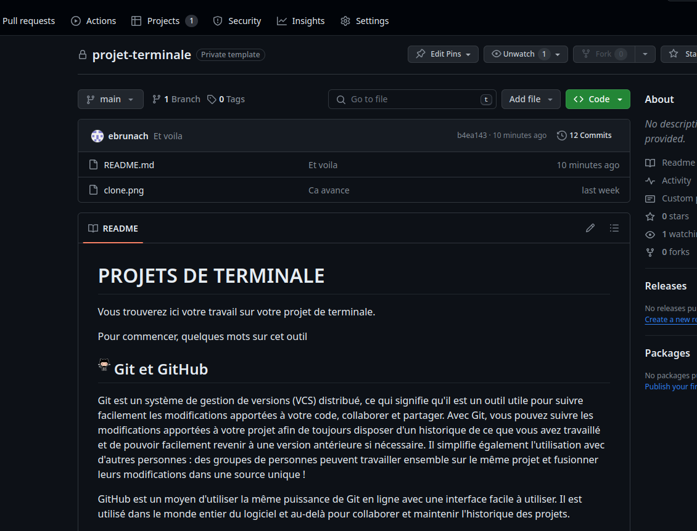

# Vers le grand oral (2/3)

## Mise en place

Pour suivre vos projets et vous donner des indications semaine par semaine, nous allons utiliser un outil important de gestion de développement logiciel appelé Github.

### Création d'un compte

Si vous n'avez pas déjà un compte, créez en un [ici](https://github.com/signup) en utilisant une adresse email personnelle car votre compte github vous suivra tout au cours de votre futur informatique.

### Premiers pas sur github

1. Suivre le lien `https://classroom.github.com/a/7jAdw6tv`
2. Choisir son identifiant.
3. Choisir un nom d'équipe.
4. Suivre la procédure.
5. Vous devriez arriver sur une page avec la suite des instruction ressemblant à ceci :

